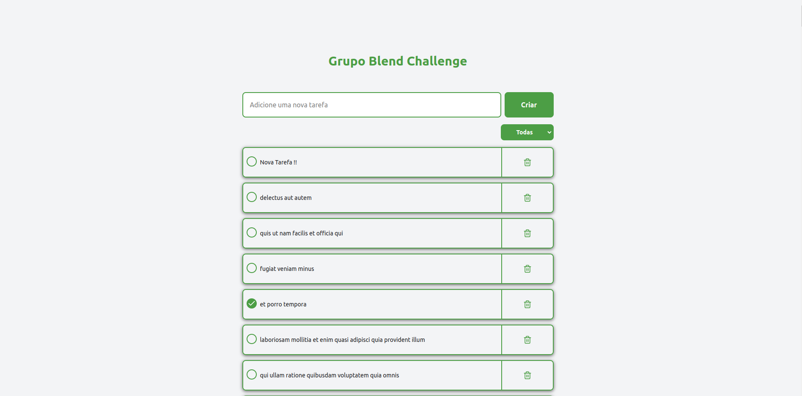

<h1 align="center">
  Blend Challenge
</h1>

<h4 align="center">
  Um Aplicativo para listar, completar e deletar tarefas.
</h4>



## Como rodar projeto localmente:

```bash
# Clone esse repositório
$ git clone https://github.com/vitoroberto/blend-challenge.git
# Ir para o repositório
$ cd blend-challenge
# Instale as dependências
$ npm install
# Rode o projeto
$ npm run dev
```

## Funcionalidades

- Adicionar uma nova tarefa.
- Marcar uma tarefa como concluída.
- Remover uma tarefa.
- Filtrar tarefas por todas, concluídas e não concluídas.
